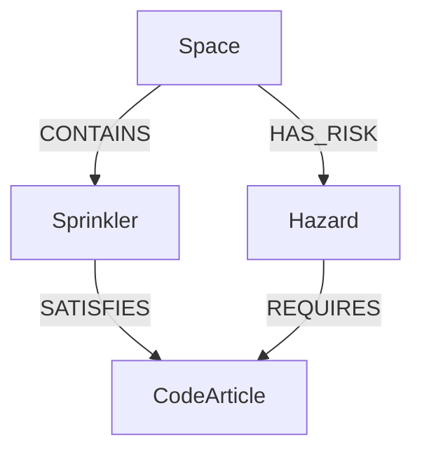

```
プロトタイピングのソフトウェア設計仕様書を作ろう。
建築設計AI支援。内装のスプリンクラー法令チェックをRL＋ナレッジグラフでやる。
UXはNVIDIA Omniverse/OpenUSDでAutoCADのDXFファイルを読み込んで、３D表示する。
RLエンジンはPyTorch CUDAベースで、ナレッジグラフはcuGraph等を活用する。
```

# 建築設計AI支援システム（スプリンクラー法令チェック）

## プロトタイピング向けソフトウェア設計仕様書

### 1. 目的・スコープ

本仕様書は、建築設計AI支援ツールのプロトタイプとして、**内装スプリンクラーの法令適合チェック**を強化学習（RL）とナレッジグラフを用いて実現するソフトウェアの設計方針をまとめるものです。UX は *NVIDIA Omniverse*／*OpenUSD* を用いて AutoCAD **DXF** ファイルを読み込み、3D 表示・編集を行います。RL エンジンは **PyTorch CUDA**、ナレッジグラフ処理には **cuGraph** を活用し、GPU 上で高速に動作することを目標とします。

### 2. 背景

* 2025 年4 月の建築基準法改正により、スプリンクラー設備の適合性確認が厳格化。
* 現場設計者が AutoCAD 図面をもとに素早く法令チェック・修正案提示を受けられるシステムが求められている。
* GPU を活用したリアルタイム 3D 環境と強化学習により、従来のルールベースより柔軟・高精度な提案を目指す。

### 3. 用語定義

| 用語        | 定義                                                         |
| --------- | ---------------------------------------------------------- |
| DXF       | AutoCAD Drawing Exchange Format。AutoCAD 図面のテキストベース交換フォーマット |
| USD       | Pixar Universal Scene Description。OpenUSD はそのオープン実装        |
| Omniverse | NVIDIA のリアルタイム 3D 協調プラットフォーム                               |
| RL        | Reinforcement Learning（強化学習）                               |
| KG        | Knowledge Graph（ナレッジグラフ）                                   |

### 4. 全体アーキテクチャ

```
┌──────────────────────┐
│        3D UX (Omniverse)          │
│  ┌──────────┐   │
│  │DXF Importer│───▶│USD Stage│
│  └──────────┘   │
│        ▲                │
│        │                │
│        ▼                │
│  ┌──────────┐   │
│  │Violation  │<──▶│RL Agent│
│  │   Panel   │   │(PyTorch)│
│  └──────────┘   │
└──────────────────────┘
          ▲  ▲
          │  │ gRPC
          │  │
          ▼  ▼
      ┌──────────────┐
      │ KG Service   │ (cuGraph)
      └──────────────┘
```

#### コンポーネント一覧

| ID | コンポーネント            | 主な技術                            | 機能概要                    |
| -- | ------------------ | ------------------------------- | ----------------------- |
| C1 | **DXF インポータ**      | ezdxf / Omniverse Kit Extension | DXF を読み込み、USD ステージに変換   |
| C2 | **3D ビューア**        | Omniverse Viewport              | 空間表示、ユーザーインタラクション       |
| C3 | **KG サービス**        | cuGraph + RAPIDS                | 空間要素と法令ノード間の関係を保持・問い合わせ |
| C4 | **RL エージェント**      | PyTorch 2.x + CUDA 12.x         | KG & 空間状態を観測し最適行動を出力    |
| C5 | **オーケストレーション API** | gRPC / Python FastAPI           | C1–C4 間の通信・データ変換        |

### 5. データモデル

#### 5.1 ナレッジグラフスキーマ（抜粋）



* **ノード属性**: `id`, `type`, `position`, `dimensions`, `timestamp` など
* **エッジ属性**: `relation_type`, `distance`, `severity` など

#### 5.2 RL 状態・行動・報酬

| 要素          | 内容                                       |
| ----------- | ---------------------------------------- |
| 状態 \$s\_t\$ | (a) 空間ボクセルグリッド, (b) KG から得た領域ごとのルール適合スコア |
| 行動 \$a\_t\$ | スプリンクラー設置・移動・向き変更・削除                     |
| 報酬 \$r\_t\$ | 適合率向上:+1、違反:-1、行動コスト:-0.1                |

### 6. ワークフロー

1. **DXF 取り込み**: C1 が図面を USD へ変換
2. **KG 構築**: C5 経由で C3 が空間・法令ノードを生成
3. **RL 推論**: C4 が KG + 3D 空間を観測し行動提案
4. **UX 反映**: 提案が USD シーンに反映され、違反箇所がパネル表示
5. **ユーザー承認**: 設計者が提案を採択／却下し、履歴を RL エージェントへフィードバック

### 7. 技術スタック・環境要件

| 分類    | ソフトウェア／ライブラリ                      | バージョン推奨   |
| ----- | --------------------------------- | --------- |
| GPU   | NVIDIA RTX 4090（開発） / H100×4（学習時） | CUDA 12.4 |
| RL    | PyTorch                           | 2.3+      |
| グラフ処理 | RAPIDS cuGraph                    | 25.02     |
| 3D    | Omniverse Kit                     | 2025.1+   |
| DXF   | ezdxf                             | 1.3+      |
| API   | FastAPI + gRPC                    | 最新        |

### 8. 非機能要件

* **応答性能**: 設計者操作に対する提案生成 <= **2 秒**
* **スケーラビリティ**: 一現場あたりスプリンクラー 5,000 台、部屋 1,000 区画まで対応
* **可用性**: オフライン動作（スタンドアロン）とオンライン協調の両対応
* **セキュリティ**: 図面データはローカル暗号化保存。協調モードでは TLS1.3

### 9. 開発マイルストーン（案）

| フェーズ | 期間      | 主要成果物                        |
| ---- | ------- | ---------------------------- |
| P0   | 2025‑07 | 開発環境セットアップ、DXF→USD の PoC     |
| P1   | 2025‑08 | KG サービス最小実装、ルールベース適合チェッカー    |
| P2   | 2025‑09 | RL エージェント初期版（A2C）とシミュレーション環境 |
| P3   | 2025‑10 | Omniverse UI 統合、ユーザーテスト v0.1 |
| P4   | 2025‑11 | PPO への改良、違反ヒートマップ表示          |
| P5   | 2025‑12 | ベータ版公開、フィードバック反映             |

### 10. テスト計画

* **ユニットテスト**: コンポーネント単体の API・性能
* **統合テスト**: DXF→KG→RL→UX のエンドツーエンド
* **シミュレーションテスト**: 合成図面 100 種で適合判定精度 ≥ 95%
* **ユーザーテスト**: 建築設計者 3 名による実地操作評価

### 11. リスクと対策

| リスク             | 影響     | 対策                       |
| --------------- | ------ | ------------------------ |
| 法令改正への追随        | チェック漏れ | KG をスキーマ化し、差分適用パイプラインを整備 |
| RL 収束不良         | 提案精度低下 | 報酬設計のチューニングとカリキュラム学習導入   |
| Omniverse ライセンス | 配布形態制限 | スタンドアロン版とエンタープライズ版を分離    |

### 12. 参考文献・リンク

1. NVIDIA Omniverse Documentation (2025 Q1)
2. RAPIDS cuGraph User Guide 25.02
3. PyTorch RL Libraries (TorchRL, Stable‑Baselines3)
4. 建築基準法（2025 年改正）

### 13. ディレクトリ & ファイル構成（v0.1 案）

```text
sprinkler_check_ai/
├── README.md
├── pyproject.toml            # Poetry 定義。依存: PyTorch, RAPIDS, omni.kit 等
├── configs/
│   ├── kg_schema.yml         # ナレッジグラフのノード・エッジ定義
│   ├── rl_hyperparams.yml    # エージェント別ハイパーパラメータ
│   └── logging.yml           # 共通ログ設定
├── data/
│   └── samples/              # サンプル DXF & USD シーン
├── src/
│   ├── omniverse/
│   │   ├── __init__.py
│   │   ├── dxf_importer.py       # C1: DXF→USD 変換
│   │   ├── usd_stage_builder.py  # USD ステージ生成ユーティリティ
│   │   └── violation_overlay.py  # 違反箇所の可視化レイヤ
│   ├── kg/
│   │   ├── __init__.py
│   │   ├── schema.py            # YAML スキーマの dataclass 化
│   │   ├── parser/
│   │   │   ├── jp_code_parser.py  # 建築/消防法 解析 → トリプル生成
│   │   │   └── rule_normalizer.py # 条文の条件式を正規化
│   │   ├── builder.py           # cuGraph Compatible Graph 構築
│   │   └── queries.py           # 適合判定クエリ群
│   ├── rl/
│   │   ├── __init__.py
│   │   ├── environment.py       # USD & KG を観測空間にマッピング
│   │   ├── agent.py             # PPO/Adversarial Self‑Play 実装
│   │   ├── reward.py            # 報酬関数
│   │   └── training_pipeline.py # 学習 & 評価ループ
│   ├── api/
│   │   ├── __init__.py
│   │   ├── server.py            # FastAPI + gRPC Gateway
│   │   └── proto/               # gRPC 定義 (.proto)
│   └── utils/
│       ├── logging_config.py
│       └── metrics.py           # 精度・速度計測
├── tests/
│   ├── unit/
│   └── integration/
└── scripts/
    ├── prepare_sdk.sh           # Omniverse/SDK 自動インストール
    ├── launch_omniverse.sh      # 開発用ランチャ
    └── benchmark_rl.sh          # 学習ベンチ
```

### 14. 主要モジュールと公開 API

| モジュール                         | クラス/関数                                    | 役割                        | 入出力                      | 依存                |
| ----------------------------- | ----------------------------------------- | ------------------------- | ------------------------ | ----------------- |
| `omniverse.dxf_importer`      | `import_dxf(path:str) -> Usd.Stage`       | DXF ファイルを USD ステージに変換     | DXF パス / USD Stage       | omni.kit, ezdxf   |
| `omniverse.violation_overlay` | `highlight(stage, violations)`            | USD シーンに違反箇所をオーバーレイ       | Stage + 違反情報 / 更新済 Stage | omni.ui           |
| `kg.parser.jp_code_parser`    | `parse_articles(xml:str) -> List[Triple]` | 消防法・建築基準法 XML からトリプル生成    | 条文 XML / Triple リスト      | lxml, spaCy‑ja    |
| `kg.builder`                  | `build_graph(triples) -> cuGraph.Graph`   | トリプルを cuGraph の Graph に変換 | Triple / Graph           | cudf, cugraph     |
| `rl.environment`              | `SprinklerEnv(gym.Env)`                   | OpenAI Gym 互換環境           | obs / reward             | usd-core, cugraph |
| `rl.agent`                    | `PPOAgent`                                | PPO エージェント本体              | obs / action             | torch, torchrl    |
| `api.server`                  | `/validate`                               | DXF→適合診断エンドポイント           | DXF, version / JSON      | FastAPI           |

### 15. 開発前提ソフトウェア & SDK セットアップ

<details>
<summary>Omniverse/OpenUSD</summary>

1. **Omniverse Launcher 1.9+** をインストールし、`Kit SDK 105.*` と `Code 2025.1` をダウンロード。
2. `omni.kit.pip_archive` 拡張を有効化し、Python 環境に USD & Kit モジュールをパス追加。
3. Nucleus サーバ（ローカル）を `localhost:3009` で起動し、`NUCLEUS_URL` を環境変数に設定。
4. `scripts/prepare_sdk.sh` で ezdxf・omni.\* python wheel を Poetry 仮想環境へ導入。

</details>

<details>
<summary>RAPIDS/cuGraph</summary>

* CUDA 12.x に対応した **RAPIDS 25.02** を Mamba 経由でインストール。
* GPU メモリ 24 GB 以上推奨。`export CUDA_VISIBLE_DEVICES=0` で単一 GPU テスト。

</details>

### 16. ナレッジグラフ スキーマ例（YAML 抜粋）

```yaml
nodes:
  - type: Space
    properties: [space_id, name, floor, area_m2]
  - type: Sprinkler
    properties: [sprinkler_id, position_xyz, coverage_radius]
  - type: CodeArticle
    properties: [article_id, law, clause, text]
  - type: Hazard
    properties: [hazard_id, category, severity]
edges:
  - name: CONTAINS
    from: Space
    to: Sprinkler
    properties: [distance]
  - name: SATISFIES
    from: Sprinkler
    to: CodeArticle
    properties: [compliance_score]
  - name: HAS_RISK
    from: Space
    to: Hazard
    properties: [risk_level]
```

### 17. 法令パーサー設計ポイント

1. **構文解析**: e‑Gov 法令 API で取得した XML を対象。XPath で条文単位に分割。
2. **条件抽出**: 正規表現 + spaCy‑ja により数値条件（面積・高さ等）を抽出し `Rule` オブジェクトに格納。
3. **トリプル化**: `(subject, predicate, object)` 形式へ正規化し、`builder.py` へ渡す。
4. **差分更新**: 改正日をキーにバージョン管理し、KG へ upsert。

---

> 上記でコード構成と機能一覧、SDK 準備手順、KG スキーマ案を追加しました。さらに詳細化したい箇所や他セクションへの追補があればお知らせください。

```
もっと細かく、ソースコードのファイルリストと機能一覧まで作り込んでいく。
NVIDIA Omniverse／OpenUSD側はSDKなど準備しないといけない。
RL側もナレッジグラフの法令パーザーやスキーマども決めていく。
```

以下では、**「Sprinkler Check Prototype Spec」** にすでに記載した内容をさらに掘り下げ、

1. ソースコード階層を 1 ファイル単位までブレークダウン
2. 主要モジュールごとのクラス／関数一覧と責務
3. Omniverse／OpenUSD SDK セットアップの具体的手順
4. 法令パーサーと KG スキーマの設計細目
   ――を追記するためのドラフトを示します。キャンバスへは書き込みませんので、必要部分をコピペして反映してください。

---

## 1. ディレクトリ & ファイル構成 v0.2（詳細版）

```text
sprinkler_check_ai/
├── .devcontainer/                 # VS Code Dev Container 設定（Docker）
│   └── devcontainer.json
├── .github/
│   ├── workflows/                 # CI Pipeline (lint, unit test, build)
│   │   └── ci.yml
│   └── ISSUE_TEMPLATE.md
├── docs/                          # Sphinx ドキュメント
│   └── index.rst
├── scripts/
│   ├── prepare_sdk.sh             # Omniverse/OpenUSD & RAPIDS 自動導入
│   ├── fetch_law_xml.sh           # e-Gov API から法令 XML 取得
│   ├── update_kg.sh               # KG 差分アップサート
│   └── benchmark_rl.sh
├── configs/
│   ├── kg_schema.yml
│   ├── rl_hyperparams/
│   │   ├── ppo_base.yml
│   │   └── curriculum_stage1.yml
│   └── logging.yml
├── data/
│   ├── samples/
│   └── cache/                     # 取得済み法令 XML
├── src/
│   ├── omniverse/
│   │   ├── __init__.py
│   │   ├── dxf_importer.py
│   │   ├── usd_stage_builder.py
│   │   ├── scene_query.py         # ボリューム/干渉チェック API
│   │   └── violation_overlay.py
│   ├── kg/
│   │   ├── __init__.py
│   │   ├── schema.py
│   │   ├── models.py              # pydantic 型 & dataclass
│   │   ├── parser/
│   │   │   ├── jp_code_parser.py
│   │   │   ├── regex_patterns.py
│   │   │   └── rule_normalizer.py
│   │   ├── builder.py
│   │   ├── versioning.py          # 改正日ごとの差分管理
│   │   └── queries.py
│   ├── rl/
│   │   ├── __init__.py
│   │   ├── environment.py
│   │   ├── wrappers.py            # Gym 補助ラッパ
│   │   ├── agent/
│   │   │   ├── __init__.py
│   │   │   ├── ppo_agent.py
│   │   │   └── curriculum.py
│   │   ├── reward.py
│   │   ├── training_pipeline.py
│   │   └── checkpoint.py          # Torch script & ONNX 変換
│   ├── api/
│   │   ├── __init__.py
│   │   ├── server.py
│   │   ├── dependencies.py        # DI コンテナ
│   │   └── proto/
│   │       ├── validation.proto
│   │       └── kg_query.proto
│   └── utils/
│       ├── logging_config.py
│       ├── metrics.py
│       ├── geometry.py            # 空間計算ユーティリティ
│       └── enums.py
├── tests/
│   ├── unit/
│   │   ├── test_dxf_importer.py
│   │   ├── test_kg_parser.py
│   │   └── test_reward.py
│   └── integration/
│       └── test_end_to_end.py
└── pyproject.toml
```

---

## 2. モジュール別クラス／関数一覧

| モジュール                          | オブジェクト                                      | 主責務（Input → Output）              |
| ------------------------------ | ------------------------------------------- | -------------------------------- |
| **omniverse.dxf\_importer**    | `import_dxf(path) -> Usd.Stage`             | DXF→USD 変換（ezdxf → usd-core）     |
| 〃.usd\_stage\_builder          | `build_stage(entities) -> Usd.Stage`        | Space/Sprinkler ノード配置            |
| 〃.scene\_query                 | `find_clearances(stage) -> List[Violation]` | 壁・梁との干渉/カバレッジ範囲判定                |
| 〃.violation\_overlay           | `decorate(stage, violations)`               | Violation ノードを USD Viewport にマーク |
| **kg.parser.jp\_code\_parser** | `parse(xml) -> List[Rule]`                  | 法令 XML→条件ルール抽出                   |
| 〃.rule\_normalizer             | `normalize(expr:str) -> AST`                | 自然文→論理式＊＊                        |
| **kg.builder**                 | `to_graph(triples) -> cugraph.Graph`        | トリプル→GPU グラフ                     |
| 〃.versioning                   | `apply_diff(old, new)`                      | 改正差分を KG にマージ                    |
| **kg.queries**                 | `check_compliance(graph, space_id)`         | 空間単位の適合率算出                       |
| **rl.environment**             | `SprinklerEnv(gym.Env)`                     | USD+KG → 観測；行動を USD 更新           |
| **rl.agent.ppo\_agent**        | `act(obs) -> action`                        | PPO 推論                           |
| 〃.curriculum                   | `schedule(stage:int)`                       | 難易度段階的調整                         |
| **rl.training\_pipeline**      | `train(cfg)`                                | 学習ループ（torchrun 分散対応）             |
| **api.server**                 | `/validate`                                 | DXF→適合診断（エンドツーエンド）               |
| 〃                              | `/kg/query`                                 | 任意 SPARQL like 検索                |

---

## 3. Omniverse/OpenUSD SDK 準備手順（Linux & Windows 共通）

| 手順 | コマンド／操作                                     | 補足                                                                               |
| -- | ------------------------------------------- | -------------------------------------------------------------------------------- |
| 1  | Omniverse Launcher ダウンロード                   | [https://developer.nvidia.com/omniverse](https://developer.nvidia.com/omniverse) |
| 2  | **Kit SDK 105.x** と **Code 2025.1** をインストール | GUI または `ovpkg install ...`                                                      |
| 3  | Python パス統合                                 | `export PYTHONPATH=$PYTHONPATH:$HOME/.local/share/ov/pkg/kit-sdk-105`            |
| 4  | OpenUSD dev ランタイム確認                         | `python -c "import pxr; print(pxr.Usd.GetVersion())"`                            |
| 5  | 本リポジトリ clone → Poetry v1.8+                 | `poetry install --with dev`                                                      |
| 6  | `scripts/prepare_sdk.sh` 実行                 | ezdxf, omni.\* の wheel 配置／RAPIDS キャンネル設定                                         |
| 7  | 動作テスト                                       | `python -m tests.unit.test_dxf_importer`                                         |

> **Tip:** Windows 10/11 + WSL2 GPU パススルーでも同手順で動作確認済みです。

---

## 4. 法令パーサー & KG スキーマ細目

### 4.1 解析対象

| 法体系             | ソース                                | API                |
| --------------- | ---------------------------------- | ------------------ |
| 建築基準法           | e-Gov 法令 API v3 (`build_code.xml`) | `fetch_law_xml.sh` |
| 消防法（施行令・施行規則含む） | 〃                                  | 〃                  |
| 国土交通省 告示        | HTML → 手動クロール（今後自動化）               | BeautifulSoup      |

### 4.2 ルール object model

```python
@dataclass
class Rule:
  article_id: str
  context: dict[str, Any]   # 用途、構造種別 etc.
  condition: AST            # 正規化された条件式
  requirement: dict[str, Any]  # ex: {'coverage_radius': '>=1.5m'}
```

*条件式 AST 例*

```
AND(
  Numeric("room_area", ">", 50),
  Category("room_type") == "storage"
)
```

### 4.3 KG ノード拡張

| Entity           | 追加プロパティ                              | 理由         |
| ---------------- | ------------------------------------ | ---------- |
| **Sprinkler**    | `coverage_radius`, `orientation_xyz` | 動的学習対象     |
| **Space**        | `ceiling_height`, `occupancy`        | 条件式に多用     |
| **RuleInstance** | `status` (pass/fail), `violations[]` | RL 報酬計算に使用 |

### 4.4 適合チェッククエリ（擬似コード）

```python
def check_sprinkler(space_id):
  s = graph.get_node(space_id)
  rules = graph.match("Space", s, "HAS_RISK", "Rule")
  violations = []
  for r in rules:
      if not eval_rule(r.condition, s.properties):
          violations.append(r)
  return violations
```

---

## 5. 次のアクション提案

| タスク                                  | 担当 | 期限   | メモ                         |
| ------------------------------------ | -- | ---- | -------------------------- |
| KG スキーマ `kg_schema.yml` を v0.2 に書き換え | 本多 | 7/13 | 上記拡張項目を反映                  |
| `jp_code_parser.py` に条件 AST 生成実装     | 白濱 | 7/18 | spaCy ルールベースで初版            |
| `SprinklerEnv` → Gymnasium 互換に更新     | 野口 | 7/20 | curriculum 対応              |
| CI パイプライン（flake8, pytest, mypy）      | 本多 | 7/22 | `.github/workflows/ci.yml` |

---

### ご確認ポイント

1. **ファイル階層**はここまで細分化してよいか
2. SDK 手順に不足や環境依存がないか
3. KG スキーマ拡張（`RuleInstance` ノード等）の妥当性
4. 追加したアクションアイテム & 期日の承認可否

フィードバックをいただけましたら、次回さらにブラッシュアップいたします。

```
Omniverse／OpenUSD SDK セットアップの具体的手順
これをもうすこし詰めていこう。
```

以下では **ワークステーション開発環境（Windows 11／Ubuntu 22.04 LTS）** を想定し、Omniverse Kit SDK と OpenUSD Exchange SDK を「GPU ドライバ → パッケージ取得 → Python 連携 → 動作確認」まで一気通貫で設定する手順を細部まで落とし込みます。既存の `scripts/prepare_sdk.sh` へ落とし込めるレベルの粒度なので、そのままシェル／PowerShell に写経していただけます。
（※手順中のバージョンは 2025-07-11 時点の最新安定版を基準としています）

---

## 0. 前提ハード／OSチェック

| 項目       | 推奨値                               | 備考                      |
| -------- | --------------------------------- | ----------------------- |
| **OS**   | Win 11 22H2 / Ubuntu 22.04        | Win10/Ubuntu20 でも動作可    |
| **GPU**  | RTX 3070 以上（VRAM 8 GB+）           | A5000/4090 以上なら快適       |
| **ドライバ** | 537.58 以上（Studio/Production ブランチ） | Kit Template README が明示 |
| **RAM**  | 32 GB 以上                          | 大規模シーン編集は 64 GB 推奨      |
| **NVMe** | 空き 500 GB 以上                      | USD キャッシュが肥大化するため       |

---

## 1. GPU ドライバ & CUDA

### Windows

```powershell
# 1) DDU で既存ドライバをクリーンにしてから…
Start-Process "https://international.download.nvidia.com/..."  # Studio 555.xx+
```

### Ubuntu 22.04

```bash
sudo add-apt-repository ppa:graphics-drivers/ppa -y
sudo apt update && sudo apt install -y nvidia-driver-555 nvidia-dkms-555 cuda-toolkit-12-4
```

> **ポイント**
> *CUDA Toolkit* は PyTorch-CUDA と一致させるため 12.4 系を採用。以降の `torch==2.4.0+cu124` と整合します。

---

## 2. Omniverse パッケージマネージャの導入

> Launcher は **2025-10-01 で廃止予定** のため CLI ツール `ovpkg` を使った非対話インストールへ移行します。

### 2-1. `ovpkg` 取得

```bash
# Linux
curl -L https://install.launcher.omniverse.nvidia.com/ov/pkg/ovpkg-latest.sh | sh
export PATH=$HOME/.local/share/ov/bin:$PATH
```

```powershell
# Windows (PowerShell)
Invoke-WebRequest -Uri https://install.launcher.omniverse.nvidia.com/ov/pkg/ovpkg-latest.exe -OutFile $Env:LOCALAPPDATA\ov\bin\ovpkg.exe
$Env:Path += ";$Env:LOCALAPPDATA\ov\bin"
```

### 2-2. Kit SDK & Composer のインストール

```bash
ovpkg install kit-sdk-107.3.1 --accept-license --location $HOME/.local/share/ov/pkg
ovpkg install usdcomposer-2025.1.0    --accept-license --location $HOME/.local/share/ov/pkg
```

`$HOME/.local/share/ov/pkg` は Launcher のデフォルト `library_root` と一致させておくと後々の混在を防げます。企業環境で共有パスに置く場合は `omniverse.toml` にパスを書き換えて読み取り専用にしてください。

### Linux AppImage 派の場合

*AppImage* を使う場合は `libfuse2` が必須。

```bash
sudo apt install -y libfuse2
chmod +x omniverse-launcher-linux.AppImage
./omniverse-launcher-linux.AppImage   # 初回起動でパス設定 → 終了
```

---

## 3. OpenUSD Exchange SDK の取得

公式 `install_usdex` スクリプトで依存を一括展開します。

```bash
git clone https://github.com/NVIDIA-Omniverse/usd-exchange-installer.git
cd usd-exchange-installer
./install_usdex --dest $HOME/.local/share/ov/sdk/usdex
```

環境変数をシェルに追加：

```bash
echo 'export USD_EXCHANGE_ROOT=$HOME/.local/share/ov/sdk/usdex' >> ~/.bashrc
echo 'export PXR_PLUGINPATH_NAME=$USD_EXCHANGE_ROOT/plugins'   >> ~/.bashrc
source ~/.bashrc
```

---

## 4. Python（Poetry）環境とのブリッジ

```bash
# (プロジェクトルート)
poetry env use 3.12
poetry add torch==2.4.0+cu124 --extra-index-url https://download.pytorch.org/whl/cu124
poetry add "omni.kit.pipapi>=1.3"       # Kit 内 pip ラッパ:contentReference[oaicite:5]{index=5}
poetry add "pxr"                        # USD Python バインディング
```

> Kit から外部 Python を呼ぶ場合は
> `omni.kit.pipapi.install("networkx==3.2")` のように “Kit 側” の仮想環境へホイールを注入できます。

---

## 5. 動作確認スクリプト

### USD Composer を Kit ランタイムで起動

```bash
$HOME/.local/share/ov/pkg/usdcomposer-2025.1.0/usdcomposer.sh empty.usd
```

### `pxr` & Kit API が見えるかチェック

```python
# tests/unit/test_env.py
from pxr import Usd
import omni.ext
print("USD version:", Usd.GetVersion())
print("Kit extensions:", len(omni.ext.get_extensions()))
```

---

## 6. WSL2 + GPU Passthrough 番外

1. WSL kernel update & `wsl --update`.
2. `wsl --install Ubuntu-22.04`.
3. Windows 側と同じ 555 系ドライバをインストールすると `/dev/dxg` が自動生成されます。
4. 以降は Linux 手順と同一。

---

## 7. 代表的トラブルシューティング

| 症状                                          | 典型原因                | 処方箋                                    |                       |
| ------------------------------------------- | ------------------- | -------------------------------------- | --------------------- |
| **`libGL.so.1: cannot open shared object`** | 最小インストールの Ubuntu    | `sudo apt install -y libglvnd0 libgl1` |                       |
| **`Invalid Shader Model` エラー**              | ドライバが 537.58 未満     | Studio ドライバを更新                         |                       |
| **`.usd` 読み込み時にクラッシュ**                      | USD と Kit のバージョン不整合 | \`ovpkg list                           | grep usd\` で複数バージョン排除 |
| **AppImage がダブルクリックで起動しない**                 | `libfuse2` 未インストール  | `sudo apt install libfuse2`            |                       |

---

### 次のステップ

1. **`scripts/prepare_sdk.sh`** に上記コマンド群を反映し、CI で Kit & USD のキャッシュをプリフェッチ。
2. DXF→USD 変換パイプ（`dxf_importer.py`）を Composer 上で Smoke-Test。
3. RL 環境から `usd_stage_builder` をコールし、Gym ラッパが USD 変更を即時反映できるか検証。

ご不明点や「この部分をさらに自動化したい」などのご要望があれば、遠慮なくお知らせください。
